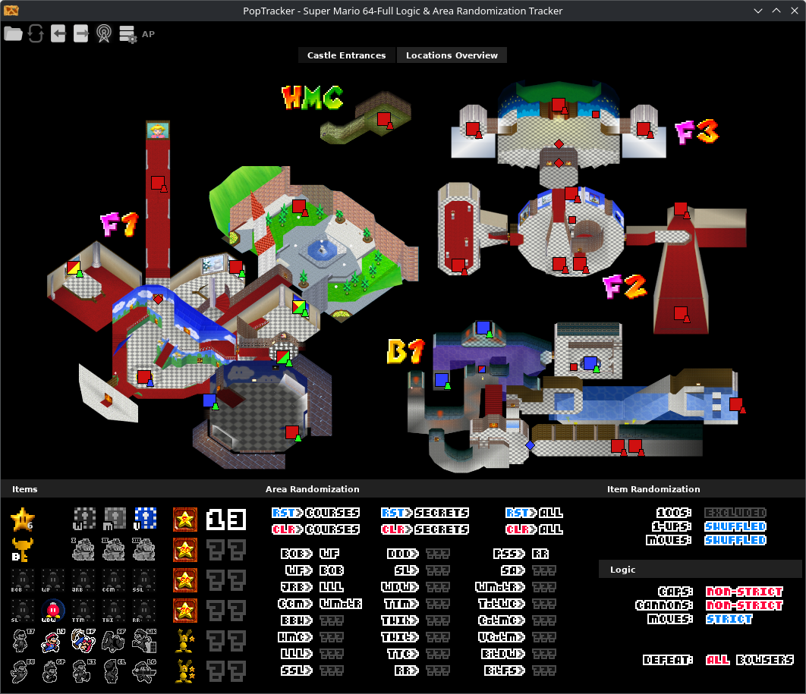

# Phar's Archipelago SM64 Randomizer PopTracker Pack

This is a [PopTracker](https://poptracker.github.io/) pack for the **Archipelago Super Mario 64 Randomizer**.



## Features

- Full Location and Item Tracking
- Star Counts
- Cap Tracking and Logic
- Cannon Tracking and Logic
- Move Tracking and Logic
- Area Tracking (ER) and Logic
- Map for Visualizing Entrances; Is ER Aware
- Broadcast View for Items and Entrances
- Auto-Tracking via Archipelago
  - Automatically tracks completed locations and collected items.
  - Automatically enables Move Randomization, if enabled.
  - Automatically enables Area Randomization, if enabled.
  - Automatically displays required star requirements for doors and MIPS.
  - Automatically displays required goal requirement.
  - Automatically toggles 100 Coin Stars if enabled/disabled.
  - Handles progressive and non-progressive keys automatically.

## Planned Features

- Auto-Tracking Settings for Bob-omb Buddies and 1-Up Blocks
- Auto-Tracking Area Randomization if Entrance is Accessible
  - ~~Basically working, but needs to be hidden behind a "spoiler" flag.~~
- Additional Maps for each Course and Secret Area.
- _Potentially more..._

## Bug Reports

This is my first time creating such a pack, so if you notice any issues or bugs, please 
[create an issue](https://github.com/ThePhar/APSM64TrackerPack/issues/new/choose) for me to investigate and include the 
exported state, the pack version, your PopTracker version, and what your expectations were.

## Compiling from Source

This includes all the source code necessary to build my pack and any of the relevant JSON, Lua, and image files.

This also includes a CLI tool I developed for automatically building, packaging, and versioning my pack. For a list of
all known flags, run:

```shell
python ./main.py -h
```

### Requirements

Python 3.12 is officially supported. Older versions may work, but I make no guarantees. No additional python 
dependencies are required.
